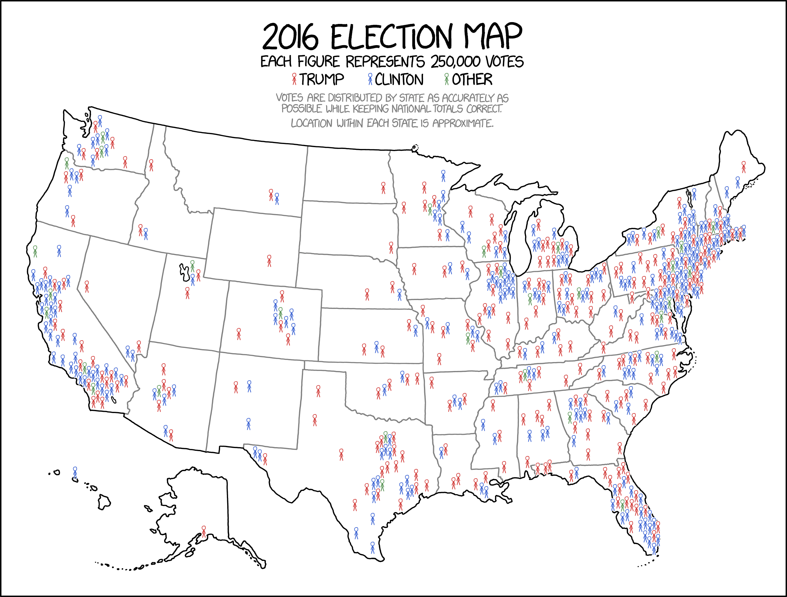

```{r setup, include=FALSE}
knitr::opts_chunk$set(warning = FALSE, message = FALSE, 
                      fig.retina = 3, fig.align = "center")
```

```{r packages-data, include=FALSE}
library(tidyverse)
library(sf)
library(patchwork)
library(glue)

set.seed(1234)

options("digits" = 2, "width" = 90)
```

```{r xaringanExtra, echo=FALSE}
xaringanExtra::use_xaringan_extra(c("tile_view"))
xaringanExtra::use_share_again()
```

class: center middle section-title section-title-4 animated fadeIn

# Maps, truth,<br>and data

---

layout: true
class: title title-4

---

# John Snow and 1854 cholera epidemic

.pull-left.center[
<figure>
  
  <figcaption>This Jo(h)n Snow knows things</figcaption>
</figure>
]

--

.pull-left.center[
.box-inv-4[10% of the population of Soho died in a week (!!)]

.box-inv-4[Miasma theory said it was because the air was bad]
]

???

https://en.wikipedia.org/wiki/John_Snow

---

layout: false
class: bg-full
background-image: url("img/01/1092px-Snow-cholera-map-1.jpg")

???

https://commons.wikimedia.org/wiki/File:Snow-cholera-map-1.jpg

---

layout: true
class: title title-4

---

# The Broad Street pump

.pull-left-wide.center[
<figure>
  
</figure>
]

.pull-left-narrow[
<figure>
  
</figure>
]

???

https://nl.wikibooks.org/wiki/Bestand:Snow-cholera-map.jpg

https://upload.wikimedia.org/wikipedia/commons/c/cb/John_Snow_memorial_and_pub.jpg

---

# Outright lies

.pull-left.center[
<figure>
  
</figure>
]

--

.pull-right.center[
<figure>
  
</figure>
]

???

Bottom map doesn't even show crime rates—it's the results from the 2012 presidential election

https://www.washingtonpost.com/news/fact-checker/wp/2016/11/16/no-the-viral-image-of-2016-election-results-and-2013-crime-rates-is-not-real/

https://me.me/i/electoral-map-2016-election-crime-rate-milo-democrats-are-as-3983235

---

# Fake maps and junk maps

.pull-left.center[
<figure>
  
  <figcaption><a href="https://www.fastcompany.com/90230916/the-next-great-fake-news-threat-bot-designed-maps" target="_blank">“The next great fake news threat? Bot-designed maps”</a></figcaption>
</figure>
]

--

.pull-right.center[
<figure>
  
</figure>
]

???

https://www.fastcompany.com/90230916/the-next-great-fake-news-threat-bot-designed-maps

https://www.reddit.com/r/funny/comments/dos6zx/finally_an_accurate_candy_map/

---

# Points can be useless

.center[
<figure>
  
</figure>
]

???

https://xkcd.com/1138/

---

# Choropleths can be great

.center[
<figure>
  
  <figcaption><a href="https://smokymountains.com/fall-foliage-map/" target="_blank">Smoky Mountains 2019 Fall Foliage Prediction Map</a></figcaption>
</figure>
]

???

https://smokymountains.com/fall-foliage-map/

---

# Choropleths can distort

.center[
<figure>
  
</figure>
]

???

https://thehill.com/blogs/blog-briefing-room/332927-trump-will-hang-map-of-2016-election-results-in-the-white-house

---

# Land doesn't vote

.center[
<video controls>
  <source src="img/01/election-map.mp4" type="video/mp4">
</video>
]

???

https://demcastusa.com/2019/11/11/land-doesnt-vote-people-do-this-electoral-map-tells-the-real-story/

[Cryptic command](https://stackoverflow.com/questions/31781238/using-ffmpeg-to-convert-gif-to-mp4-output-doesnt-play-on-android) to convert gif to mp4: 

```text
ffmpeg -r 30 -i input.gif -movflags faststart -pix_fmt yuv420p -vf "scale=trunc(iw/2)*2:trunc(ih/2)*2" out.mp4
```

---

# Cartograms

&nbsp;

.pull-left-3.center[
<figure>
  
</figure>
]

.pull-middle-3.center[
<figure>
  
</figure>
]

.pull-right-3.center[
<figure>
  
</figure>
]

???

http://metrocosm.com/election-2016-map-3d/

---

layout: false
class: bg-full
background-image: url("img/01/Election2015_WinnerChangeMaps.jpg")

???

http://www.viewsoftheworld.net/?p=4570

---

.center[
<figure>
  
</figure>
]

???

https://xkcd.com/1939/

---

layout: true
class: title title-4

---

# Projections

.box-inv-4.medium[[Animated world projections](https://bl.ocks.org/mbostock/raw/3711652/)]

???

Disable my video so OBS is happy

---

# World projections

```{r projections, echo=FALSE, fig.width=8, fig.height=3.75, out.width="100%"}
world_shapes <- read_sf("data/ne_110m_admin_0_countries/ne_110m_admin_0_countries.shp") %>% 
  filter(ISO_A3 != "ATA")

base_map <- ggplot() + 
  geom_sf(data = world_shapes, fill = "#B2B1F9", size = 0.1, color = "#0D0887") +
  theme_void(base_family = "Fira Sans Condensed") + 
  theme(plot.margin = unit(c(0.5, 0.5, 0.5, 0.5), "lines"),
        plot.title = element_text(margin = margin(b = 3), face = "bold"),
        plot.caption = element_text(family = "Consolas", color = "grey50"))

# Longitude/latitude
map_lat_lon <- base_map +
  coord_sf(crs = "+proj=longlat +ellps=WGS84 +datum=WGS84 +no_def") +
  labs(title = "Longitude-latitude",
       caption = 'crs = "+proj=longlat +ellps=WGS84"')

# Robinson
map_robinson <- base_map +
  coord_sf(crs = "+proj=robin") +
  # coord_sf(crs = 54030, datum = NA) +  # Robinson
  labs(title = "Robinson",
       caption = 'crs = "+proj=robin"')

# Mercator (ew)
map_mercator <- base_map +
  coord_sf(crs = "+proj=merc") +
  # coord_sf(crs = 54004, datum = NA) +  # Mercator
  labs(title = "Mercator",
       caption = 'crs = "+proj=merc"')

# Gall Peters
map_gall_peters <- base_map +
  coord_sf(crs = st_crs("ESRI:54002"), datum = NA) +  # Gall Peters / Equidistant cylindrical
  labs(title = "Gall-Peters",
       caption = 'crs = "ESRI:54002"')

(map_lat_lon / map_mercator) | (map_gall_peters / map_robinson) 

# Equal earth
# base_map +
#   coord_sf(crs = "+proj=eqearth +wktext") +  # Equal earth 
#   labs(title = "Equal Earth",
#        caption = 'crs = "+proj=eqearth +wktext"')
```

---

# US projections

```{r us-projections, echo=FALSE, fig.width=8, fig.height=3.75, out.width="100%"}
us_states <- read_sf("data/cb_2018_us_state_20m/cb_2018_us_state_20m.shp")

states_48 <- us_states %>% 
  filter(!(STUSPS %in% c("HI", "AK", "PR")))

map_nad83 <- ggplot() +
  geom_sf(data = states_48, fill = "#B2B1F9", size = 0.25, color = "#0D0887") +
  labs(title = "NAD83",
       caption = 'crs = "EPSG:4269"') +
  coord_sf(crs = st_crs("EPSG:4269"), datum = NA) +
  theme_void(base_family = "Fira Sans Condensed") + 
  theme(plot.margin = unit(c(0.5, 0.5, 0.5, 0.5), "lines"),
        plot.title = element_text(margin = margin(b = 3), face = "bold"),
        plot.caption = element_text(family = "Consolas", color = "grey50"))

map_albers <- ggplot() +
  geom_sf(data = states_48, fill = "#B2B1F9", size = 0.25, color = "#0D0887") +
  labs(title = "Albers",
       caption = 'crs = "ESRI:102003"') +
  coord_sf(crs = st_crs("ESRI:102003"), datum = NA) +
  theme_void(base_family = "Fira Sans Condensed") + 
  theme(plot.margin = unit(c(0.5, 0.5, 0.5, 0.5), "lines"),
        plot.title = element_text(margin = margin(b = 3), face = "bold"),
        plot.caption = element_text(family = "Consolas", color = "grey50"))

map_nad83 | map_albers
```

---

# Finding projection codes

.box-inv-4[[epsg.io](https://epsg.io/)]

.box-inv-4[[proj.org](https://proj.org/operations/projections/index.html)]

--

.box-inv-4[Most common ones listed on the<br>[workshop website](/example/12-example/)]

--

.box-inv-4.small[[This](https://www.earthdatascience.org/courses/earth-analytics/spatial-data-r/understand-epsg-wkt-and-other-crs-definition-file-types/) is an excellent overview of how this all works]

.box-inv-4.small[And [this](https://web.archive.org/web/20200225021219/https://www.nceas.ucsb.edu/~frazier/RSpatialGuides/OverviewCoordinateReferenceSystems.pdf) is a really really helpful overview of all these moving parts]

---

# Which projection is best?

--

.box-inv-4.medium[None of them]

--

.box-4[There are no good or bad projections]

--

.box-4[There are appropriate and<br>inappropriate projections]

--

.box-inv-4.small[(but also ew mercator)]

---

layout: false
class: center middle section-title section-title-3 animated fadeIn

# Putting data on maps

---

layout: true
class: title title-3

---

# Maps with lines

.center[
<figure>
  
  <figcaption><a href="https://www.census.gov/dataviz/visualizations/051/" target="_blank">US Census Bureau: Net migration between California and other states</a></figcaption>
</figure>
]

???

https://www.census.gov/dataviz/visualizations/051/

---

# Maps with lines

.center[
<figure>
  
  <figcaption><a href="http://hint.fm/wind/index.html" target="_blank">hint.fm Live Wind Map</a></figcaption>
</figure>
]

???

http://hint.fm/wind/index.html

---

layout: false
class: bg-full
background-image: url("img/01/streams-lakes-bw-100-w-01.jpg")

???

https://kieranhealy.org/prints/rivers/

---

layout: true
class: title title-3

---

# Maps with points

.center[
<figure>
  
  <figcaption><a href="https://www.flickr.com/photos/idvsolutions/7840356344/" target="_blank">Every hurricane since 1851, by IDV solutions</a></figcaption>
</figure>
]

???

https://www.flickr.com/photos/idvsolutions/7840356344/

---

# Maps with points

.center[
<figure>
  
  <figcaption><a href="https://www.nytimes.com/interactive/2015/02/06/us/california-measles-vaccines-map.html" target="_blank">The New York Times, "Vaccination Rates for Every Kindergarten in California</a></figcaption>
</figure>
]

???

https://www.nytimes.com/interactive/2015/02/06/us/california-measles-vaccines-map.html

---

# Maps with points

.center[
<figure>
  
  <figcaption><a href="https://www.flickr.com/photos/walkingsf/4672195208/in/album-72157624209158632/" target="_blank">Locals vs. tourists in DC (blue = locals; red = tourists; yellow = unknown)</a></figcaption>
</figure>
]

???

https://www.flickr.com/photos/walkingsf/4672195208/in/album-72157624209158632/

---

# Voronoi maps

.pull-left.center[
<figure>
  
  <figcaption><a href="http://vizual-statistix.tumblr.com/post/48625446909/these-are-voronoi-maps-of-the-contiguous-usa" target="_blank">Voroni state boundaries, by Seth Kadish</a></figcaption>
</figure>
]

--

.pull-right.center[
<figure>
  
  <figcaption><a href="https://www.reddit.com/r/nba/comments/27got5/which_team_is_closest_to_you_a_voronoi_diagram/" target="_blank">Closest NBA teams</a></figcaption>
</figure>
]

???

http://vizual-statistix.tumblr.com/post/48625446909/these-are-voronoi-maps-of-the-contiguous-usa

https://www.reddit.com/r/nba/comments/27got5/which_team_is_closest_to_you_a_voronoi_diagram/

---

# Maps with shapes

.center[
<figure>
  
</figure>
]

???

https://archive.nytimes.com/www.nytimes.com/interactive/2013/11/20/us/which-states-will-allow-old-health-policies-to-be-renewed.html

---

# Small multiples that look like maps

.center[
<figure>
  
  <figcaption><code>facet_geo()</code> in the <a href="https://hafen.github.io/geofacet/" target="_blank"><strong>geofacet</strong> package</a></figcaption>
</figure>
]


```{r echo=FALSE, include=FALSE, eval=FALSE}
pagedown::chrome_print(here::here("slides", "01_maps-truth-data.html"), 
                       output = here::here("slides", "01_maps-truth-data.pdf"))
```
