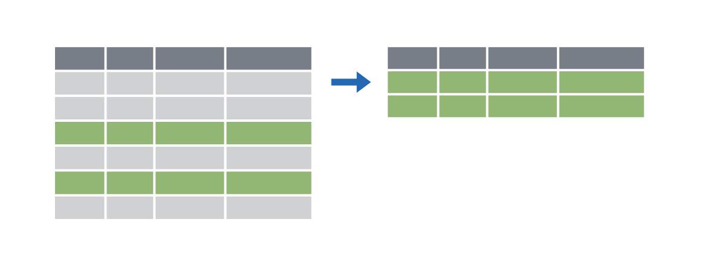

```{r setup, include=FALSE}
knitr::opts_chunk$set(warning = FALSE, message = FALSE, 
                      fig.retina = 3, fig.align = "center")
```

```{r packages-data, include=FALSE}
library(tidyverse)
library(gapminder)
library(countdown)
library(flair)
library(knitr)
library(kableExtra)
```

```{r xaringanExtra, echo=FALSE}
xaringanExtra::use_xaringan_extra(c("tile_view"))
xaringanExtra::use_share_again()
```

class: center middle section-title section-title-2

# Transform data<br>with dplyr

.class-info[
<figure>
  
</figure>
]

---

class: title title-2

# The tidyverse

<figure>
  
</figure>

???

From "Master the Tidyverse" by RStudio

---

class: title title-2

# The tidyverse

.center[
<figure>
  
</figure>
]

---

class: title title-2

# dplyr: verbs for manipulating data

<table>
  <tr>
    <td>Extract rows with <code>filter()</code></td>
    <td></td>
  </tr>
  <tr>
    <td>Extract columns with <code>select()</code></td>
    <td></td>
  </tr>
  <tr>
    <td>Arrange/sort rows with <code>arrange()</code></td>
    <td></td>
  </tr>
  <tr>
    <td>Make new columns with <code>mutate()</code></td>
    <td></td>
  </tr>
  <tr>
    <td>Make group summaries with<br><code>group_by() %>% summarize()</code></td>
    <td></td>
  </tr>
</table>

---

layout: false
class: title title-2

# `filter()`

.box-inv-2[Extract rows that meet some sort of test]

.pull-left[
```{r show-filter-template, echo=FALSE, tidy=FALSE}
decorate('
filter(DATA, ...)
', eval = FALSE) %>% 
  flair("DATA", background = "#FFDFD1", before = "<b>", after = "</b>") %>% 
  flair("...", background = "#FFD0CF", before = "<b>", after = "</b>")
```
]

.pull-right[
- <b><span style="background: #FFDFD1">`DATA`</span></b> = Data frame to transform
- <b><span style="background: #FFD0CF">`...`</span></b> = One or more tests <br>.small[`filter()` returns each row for which the test is TRUE]
]

---

```{r echo=FALSE, tidy=FALSE}
decorate('
filter(gapminder, country == "Denmark")
', eval = FALSE) %>% 
  flair("gapminder", background = "#FFDFD1", before = "<b>", after = "</b>") %>% 
  flair('country == "Denmark"', background = "#FFD0CF", before = "<b>", after = "</b>")
```

.pull-left[
```{r echo=FALSE}
gapminder %>% 
  select(country, continent, year) %>% 
  head(5) %>% 
  mutate(year = as.character(year)) %>% 
  bind_rows(tibble(country = "…", continent = "…", year = "…")) %>% 
  knitr::kable(format = "html")
```
]

--

.pull-right[
```{r echo=FALSE}
gapminder %>% 
  select(country, continent, year) %>% 
  filter(country == "Denmark") %>% 
  head(6) %>% 
  knitr::kable(format = "html")
```
]

---

class: title title-2

# Logical tests

<table>
  <tr>
    <th class="cell-center">Test</th>
    <th class="cell-left">Meaning</th>
    <th class="cell-center">Test</th>
    <th class="cell-left">Meaning</th>
  </tr>
  <tr>
    <td class="cell-center"><code class="remark-inline-code">x < y</code></td>
    <td class="cell-left">Less than</td>
    <td class="cell-center"><code class="remark-inline-code">x %in% y</code></td>
    <td class="cell-left">In (group membership)</td>
  </tr>
  <tr>
    <td class="cell-center"><code class="remark-inline-code">x > y</code></td>
    <td class="cell-left">Greater than</td>
    <td class="cell-center"><code class="remark-inline-code">is.na(x)</code></td>
    <td class="cell-left">Is missing</td>
  </tr>
  <tr>
    <td class="cell-center"><code class="remark-inline-code">==</code></td>
    <td class="cell-left">Equal to</td>
    <td class="cell-center"><code class="remark-inline-code">!is.na(x)</code></td>
    <td class="cell-left">Is not missing</td>
  </tr>
  <tr>
    <td class="cell-center"><code class="remark-inline-code">x <= y</code></td>
    <td class="cell-left">Less than or equal to</td>
  </tr>
  <tr>
    <td class="cell-center"><code class="remark-inline-code">x >= y</code></td>
    <td class="cell-left">Greater than or equal to</td>
  </tr>
  <tr>
    <td class="cell-center"><code class="remark-inline-code">x != y</code></td>
    <td class="cell-left">Not equal to</td>
  </tr>
</table>

---

class: title title-2 section-title-inv-2

# Your turn #1: Filtering

.box-2[Use `filter()` and logical tests to show…]

1. The data for Canada
2. All data for countries in Oceania
3. Rows where the life expectancy is greater than 82

```{r echo=FALSE}
countdown(minutes = 3, play_sound = TRUE, font_size = "1.5em")
```

---

.medium[
```{r eval=FALSE}
filter(gapminder, country == "Canada")
```
]

--

.medium[
```{r eval=FALSE}
filter(gapminder, continent == "Oceania")
```
]

--

.medium[
```{r eval=FALSE}
filter(gapminder, lifeExp > 82)
```
]

---

class: title title-2

# `filter()` with multiple conditions

.box-inv-2[Extract rows that meet *every* test]

```{r echo=FALSE, tidy=FALSE}
decorate('
filter(gapminder, country == "Denmark", year > 2000)
', eval = FALSE) %>% 
  flair("gapminder", background = "#FFDFD1", before = "<b>", after = "</b>") %>% 
  flair('country == "Denmark", year > 2000', background = "#FFD0CF", before = "<b>", after = "</b>")
```

---

```{r echo=FALSE, tidy=FALSE}
decorate('
filter(gapminder, country == "Denmark", year > 2000)
', eval = FALSE) %>% 
  flair("gapminder", background = "#FFDFD1", before = "<b>", after = "</b>") %>% 
  flair('country == "Denmark", year > 2000', background = "#FFD0CF", before = "<b>", after = "</b>")
```

.pull-left[
```{r echo=FALSE}
gapminder %>% 
  select(country, continent, year) %>% 
  head(5) %>% 
  mutate(year = as.character(year)) %>% 
  bind_rows(tibble(country = "…", continent = "…", year = "…")) %>% 
  knitr::kable(format = "html")
```
]

--

.pull-right[
```{r echo=FALSE}
gapminder %>% 
  select(country, continent, year) %>% 
  filter(country == "Denmark", year > 2000) %>% 
  head(6) %>% 
  knitr::kable(format = "html")
```
]

---

class: title title-2

# Boolean operators

<table>
  <tr>
    <th class="cell-center">Operator</th>
    <th class="cell-center">Meaning</th>
  </tr>
  <tr>
    <td class="cell-center"><code class="remark-inline-code">a & b</code></td>
    <td class="cell-center">and</td>
  </tr>
  <tr>
    <td class="cell-center"><code class="remark-inline-code">a | b</code></td>
    <td class="cell-center">or</td>
  </tr>
  <tr>
    <td class="cell-center"><code class="remark-inline-code">!a</code></td>
    <td class="cell-center">not</td>
  </tr>
</table>

---

class: title title-2

# Default is "and"

.box-inv-2[These do the same thing:]

```{r echo=FALSE, tidy=FALSE}
decorate('
filter(gapminder, country == "Denmark", year > 2000)
', eval = FALSE) %>% 
  flair("gapminder", background = "#FFDFD1", before = "<b>", after = "</b>") %>% 
  flair('country == "Denmark", year > 2000', background = "#FFD0CF", before = "<b>", after = "</b>")
```

```{r echo=FALSE, tidy=FALSE}
decorate('
filter(gapminder, country == "Denmark" & year > 2000)
', eval = FALSE) %>% 
  flair("gapminder", background = "#FFDFD1", before = "<b>", after = "</b>") %>% 
  flair('country == "Denmark" & year > 2000', background = "#FFD0CF", before = "<b>", after = "</b>")
```

---

class: title title-2 section-title-inv-2

# Your turn #2: Filtering

.box-2[Use `filter()` and Boolean logical tests to show…]

1. Canada before 1970
2. Countries where life expectancy in 2007 is below 50
3. Countries where life expectancy in 2007 is below 50 and are not in Africa

```{r echo=FALSE}
countdown(minutes = 3)
```

---

```{r eval=FALSE}
filter(gapminder, country == "Canada", year < 1970)
```

--

```{r eval=FALSE}
filter(gapminder, year == 2007, lifeExp < 50)
```

--

```{r eval=FALSE}
filter(gapminder, year == 2007, lifeExp < 50, 
       continent != "Africa")
```

---

class: title title-2

# Common mistakes

.pull-left[
.box-inv-2[Collapsing multiple tests<br>into one]

.small-code[
```{r echo=FALSE, tidy=FALSE}
decorate('
filter(gapminder, 1960 &lt; year &lt; 1980)
', eval = FALSE) %>% 
  flair("1960 &lt; year &lt; 1980", color = "#FF4136", before = "<b>", after = "</b>")
```
]

.small-code[
```{r echo=FALSE, tidy=FALSE}
decorate('
filter(gapminder, 
       year > 1960, year &lt; 1980)
', eval = FALSE) %>% 
  flair("year > 1960, year &lt; 1980", color = "#2ECC40", before = "<b>", after = "</b>")
```
]
]

--

.pull-right[
.box-inv-2[Using multiple tests<br>instead of `%in%`]

.small-code[
```{r echo=FALSE, tidy=FALSE}
decorate('
filter(gapminder, 
       country == "Mexico", 
       country == "Canada", 
       country == "United States")
', eval = FALSE) %>% 
  flair('country == "Mexico", 
       country == "Canada", 
       country == "United States"', color = "#FF4136", before = "<b>", after = "</b>")
```
]

.small-code[
```{r echo=FALSE, tidy=FALSE}
decorate('
filter(gapminder, 
       country %in% c("Mexico", "Canada", 
                      "United States"))
', eval = FALSE) %>% 
  flair('country %in% c("Mexico", "Canada", 
                      "United States")', color = "#2ECC40", before = "<b>", after = "</b>")
```
]
]

---

class: title title-2

# Common syntax

.box-inv-2[Every dplyr verb function follows the same pattern]

.box-inv-2[First argument is a data frame; returns a data frame]

.pull-left[
```{r echo=FALSE, tidy=FALSE}
decorate('
VERB(DATA, ...)
', eval = FALSE) %>% 
  flair("VERB", background = "#EFB3FF", before = "<b>", after = "</b>") %>% 
  flair("DATA", background = "#FFDFD1", before = "<b>", after = "</b>") %>% 
  flair("...", background = "#FFD0CF", before = "<b>", after = "</b>")
```
]

.pull-right[
- <b><span style="background: #EFB3FF">`VERB`</span></b> = dplyr function/verb
- <b><span style="background: #FFDFD1">`DATA`</span></b> = Data frame to transform
- <b><span style="background: #FFD0CF">`...`</span></b> = Stuff the verb does
]

---

class: title title-2

# `mutate()`

.box-inv-2[Create new columns]

.pull-left[
```{r echo=FALSE, tidy=FALSE}
decorate('
mutate(DATA, ...)
', eval = FALSE) %>% 
  flair("DATA", background = "#FFDFD1", before = "<b>", after = "</b>") %>% 
  flair("...", background = "#FFD0CF", before = "<b>", after = "</b>")
```
]

.pull-right[
- <b><span style="background: #FFDFD1">`DATA`</span></b> = Data frame to transform
- <b><span style="background: #FFD0CF">`...`</span></b> = Columns to make
]

---

```{r echo=FALSE, tidy=FALSE}
decorate('
mutate(gapminder, gdp = gdpPercap * pop)
', eval = FALSE) %>% 
  flair("gapminder", background = "#FFDFD1", before = "<b>", after = "</b>") %>% 
  flair('gdp = gdpPercap * pop', background = "#FFD0CF", before = "<b>", after = "</b>")
```

.pull-left.small[
```{r echo=FALSE}
gapminder %>% 
  select(country, year, gdpPercap, pop) %>% 
  head(5) %>% 
  mutate_at(vars(year, gdpPercap, pop), ~as.character(.)) %>% 
  bind_rows(tibble(country = "…", year = "…", gdpPercap = "…", pop = "…")) %>% 
  knitr::kable(format = "html")
```
]

--

.pull-right.small[
```{r echo=FALSE}
gapminder %>% 
  mutate(gdp = gdpPercap * pop) %>% 
  mutate(`…` = "…") %>% 
  select(country, year, `…`, gdp) %>% 
  head(6) %>% 
  knitr::kable(format = "html")
```
]

---

```{r echo=FALSE, tidy=FALSE}
decorate('
mutate(gapminder, gdp = gdpPercap * pop,
                  pop_mil = round(pop / 1000000))
', eval = FALSE) %>% 
  flair("gapminder", background = "#FFDFD1", before = "<b>", after = "</b>") %>% 
  flair('gdp = gdpPercap * pop,', background = "#FFD0CF", before = "<b>", after = "</b>") %>% 
  flair('pop_mil = round(pop / 1000000)', background = "#FFD0CF", before = "<b>", after = "</b>")
```

.pull-left.small[
```{r echo=FALSE}
gapminder %>% 
  select(country, year, gdpPercap, pop) %>% 
  head(5) %>% 
  mutate_at(vars(year, gdpPercap, pop), ~as.character(.)) %>% 
  bind_rows(tibble(country = "…", year = "…", gdpPercap = "…", pop = "…")) %>% 
  knitr::kable(format = "html")
```
]

--

.pull-right.small[
```{r echo=FALSE}
gapminder %>% 
  mutate(gdp = gdpPercap * pop,
         pop_mil = round(pop / 1000000)) %>% 
  mutate(`…` = "…") %>% 
  select(country, year, `…`, gdp, pop_mil) %>% 
  head(6) %>% 
  knitr::kable(format = "html")
```
]

---

class: title title-2

# `ifelse()`

.box-inv-2[Do conditional tests within `mutate()`]

.pull-left[
```{r echo=FALSE, tidy=FALSE}
decorate('
ifelse(TEST, 
       VALUE_IF_TRUE, 
       VALUE_IF_FALSE)
', eval = FALSE) %>% 
  flair("TEST", background = "#FFC0DC", before = "<b>", after = "</b>") %>% 
  flair("VALUE_IF_TRUE", background = "#FFDFD1", before = "<b>", after = "</b>") %>% 
  flair("VALUE_IF_FALSE", background = "#CBB5FF", before = "<b>", after = "</b>")
```
]

.pull-right[
- <b><span style="background: #FFC0DC">`TEST`</span></b> = A logical test
- <b><span style="background: #FFDFD1">`VALUE_IF_TRUE`</span></b> = What happens if test is true
- <b><span style="background: #CBB5FF">`VALUE_IF_FALSE`</span></b> = What happens if test is false
]

---

```{r echo=FALSE, tidy=FALSE}
decorate('
mutate(gapminder, 
       after_1960 = ifelse(year > 1960, TRUE, FALSE))
', eval = FALSE) %>% 
  flair("year > 1960", background = "#FFC0DC", before = "<b>", after = "</b>") %>% 
  flair("TRUE", background = "#FFDFD1", before = "<b>", after = "</b>") %>% 
  flair("FALSE", background = "#CBB5FF", before = "<b>", after = "</b>")
```

```{r echo=FALSE, tidy=FALSE}
decorate('
mutate(gapminder, 
       after_1960 = ifelse(year > 1960, 
                           "After 1960", 
                           "Before 1960"))
', eval = FALSE) %>% 
  flair("year > 1960", background = "#FFC0DC", before = "<b>", after = "</b>") %>% 
  flair('"After 1960"', background = "#FFDFD1", before = "<b>", after = "</b>") %>% 
  flair('"Before 1960"', background = "#CBB5FF", before = "<b>", after = "</b>")
```

---

class: title title-2 section-title-inv-2

# Your turn #3: Mutating

.box-2[Use `mutate()` to…]

1. Add an `africa` column that is TRUE if the country is on the African continent
2. Add a column for logged GDP per capita (hint: use `log()`)
3. Add an `africa_asia` column that says “Africa or Asia” if the country is in Africa or Asia, and “Not Africa or Asia” if it’s not

```{r echo=FALSE}
countdown(minutes = 3)
```

---

```{r eval=FALSE}
mutate(gapminder, africa = ifelse(continent == "Africa", 
                                  TRUE, FALSE))
```

--

```{r eval=FALSE}
mutate(gapminder, log_gdpPercap = log(gdpPercap))
```

--

```{r eval=FALSE}
mutate(gapminder, 
       africa_asia = 
         ifelse(continent %in% c("Africa", "Asia"), 
                "Africa or Asia", 
                "Not Africa or Asia"))
```

---

class: title title-2

# What if you have multiple verbs?

.box-inv-2.sp-after[Make a dataset for just 2002 *and* calculate logged GDP per capita]

--

.box-inv-2[Solution 1: Intermediate variables]

```{r echo=FALSE, tidy=FALSE}
decorate('
gapminder_2002 <- filter(gapminder, year == 2002)

gapminder_2002_log <- mutate(gapminder_2002,
                             log_gdpPercap = log(gdpPercap))
', eval = FALSE) %>% 
  flair("gapminder_2002", background = "#FFC0DC", before = "<b>", after = "</b>") %>% 
  flair("gapminder_2002_log", background = "#FFDFD1", before = "<b>", after = "</b>")
```

---

class: title title-2

# What if you have multiple verbs?

.box-inv-2.sp-after[Make a dataset for just 2002 *and* calculate logged GDP per capita]

.box-inv-2[Solution 2: Nested functions]

```{r echo=FALSE, tidy=FALSE}
decorate('
filter(mutate(gapminder_2002, 
              log_gdpPercap = log(gdpPercap)), 
       year == 2002)
', eval = FALSE) %>% 
  flair("filter(", background = "#FFC0DC", before = "<b>", after = "</b>") %>% 
  flair("year == 2002)", background = "#FFC0DC", before = "<b>", after = "</b>") %>% 
  flair("mutate(gapminder_2002,", background = "#FFDFD1", before = "<b>", after = "</b>") %>% 
  flair("log_gdpPercap = log(gdpPercap))", background = "#FFDFD1", before = "<b>", after = "</b>")
```

---

class: title title-2

# What if you have multiple verbs?

.box-inv-2.sp-after[Make a dataset for just 2002 *and* calculate logged GDP per capita]

.box-inv-2[Solution 3: Pipes!]

.box-inv-2[The `%>%` operator (pipe) takes an object on the left<br>and passes it as the first argument of the function on the right]

```{r echo=FALSE, tidy=FALSE}
decorate('
gapminder %>% filter(_____, country == "Canada")
', eval = FALSE) %>% 
  flair("gapminder", background = "#FFC0DC", before = "<b>", after = "</b>") %>% 
  flair("_____", background = "#FFC0DC", before = "<b>", after = "</b>")
```

---

class: title title-2

# What if you have multiple verbs?

.box-inv-2[These do the same thing!]

```{r echo=FALSE, tidy=FALSE}
decorate('
filter(gapminder, country == "Canada")
', eval = FALSE) %>% 
  flair("gapminder", background = "#FFC0DC", before = "<b>", after = "</b>")
```

```{r echo=FALSE, tidy=FALSE}
decorate('
gapminder %>% filter(country == "Canada")
', eval = FALSE) %>% 
  flair("gapminder", background = "#FFC0DC", before = "<b>", after = "</b>")
```

---

class: title title-2

# What if you have multiple verbs?

.box-inv-2.sp-after[Make a dataset for just 2002 *and* calculate logged GDP per capita]

.box-inv-2[Solution 3: Pipes!]

```{r echo=FALSE, tidy=FALSE}
decorate('
gapminder %>% 
  filter(year == 2002) %>% 
  mutate(log_gdpPercap = log(gdpPercap))
', eval = FALSE)
```

---

class: title title-2

# `%>%`

```{r echo=FALSE, tidy=FALSE}
decorate('
leave_house(get_dressed(get_out_of_bed(wake_up(me, time = "8:00"), side = "correct"), pants = TRUE, shirt = TRUE), car = TRUE, bike = FALSE)
', eval = FALSE) %>% 
  flair_args(color = "#0D0887") %>%
  flair_funs(background = "#FFC0DC", before = "<b>", after = "</b>") %>%
  flair_input_vals(color = "#E16462")
```

--

```{r echo=FALSE, tidy=FALSE}
decorate('
me %>% 
  wake_up(time = "8:00") %>% 
  get_out_of_bed(side = "correct") %>% 
  get_dressed(pants = TRUE, shirt = TRUE) %>% 
  leave_house(car = TRUE, bike = FALSE)
', eval = FALSE) %>% 
  flair_args(color = "#0D0887") %>%
  flair_funs(background = "#FFC0DC", before = "<b>", after = "</b>") %>%
  flair_input_vals(color = "#E16462")
```

---

class: title title-2

# dplyr: verbs for manipulating data

<table>
  <tr>
    <td>Extract rows with <code>filter()</code></td>
    <td></td>
  </tr>
  <tr>
    <td>Extract columns with <code>select()</code></td>
    <td></td>
  </tr>
  <tr>
    <td>Arrange/sort rows with <code>arrange()</code></td>
    <td></td>
  </tr>
  <tr>
    <td>Make new columns with <code>mutate()</code></td>
    <td></td>
  </tr>
  <tr>
    <td>Make group summaries with<br><code>group_by() %>% summarize()</code></td>
    <td></td>
  </tr>
</table>


```{r echo=FALSE, include=FALSE, eval=FALSE}
pagedown::chrome_print(here::here("slides", "02c_transform-data.html"), 
                       output = here::here("slides", "02c_transform-data.pdf"))
```
