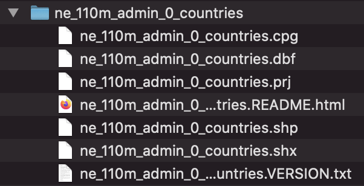
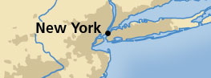
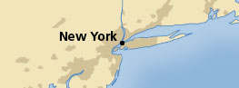
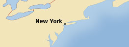

```{r setup, include=FALSE}
knitr::opts_chunk$set(warning = FALSE, message = FALSE, 
                      fig.retina = 3, fig.align = "center")
```

```{r packages-data, include=FALSE}
library(tidyverse)
library(sf)
library(patchwork)
library(glue)

set.seed(1234)

options("digits" = 2, "width" = 90)

world_shapes <- read_sf("data/ne_110m_admin_0_countries/ne_110m_admin_0_countries.shp") %>% 
  filter(ISO_A3 != "ATA")

places <- readRDS("data/places_geocoded.rds")
```

```{r geocoding-actual, eval=FALSE, include=FALSE}
places <- tribble(
  ~name, ~address,
  "My empty GSU office", "14 Marietta Street NW, Atlanta, GA 30303",
  "My old BYU office", "155 East 1230 North, Provo, UT 84604",
  "My old Duke office", "201 Science Dr, Durham, NC 27708"
) %>% 
  geocode(address, method = "arcgis") %>% 
  st_as_sf(coords = c("long", "lat"), crs = 4326)

saveRDS(places, "slides/data/places_geocoded.rds")
```


```{r xaringanExtra, echo=FALSE}
xaringanExtra::use_xaringan_extra(c("tile_view"))
xaringanExtra::use_share_again()
```

class: center middle section-title section-title-6 animated fadeIn

# GIS in R with **sf**

---

layout: true
class: title title-6

---

# Shapefiles

.box-6[Geographic information is shared as **shapefiles**]

--

.box-inv-6[These are *not* like regular single CSV files!]

--

.box-inv-6[Shapefiles come as zipped files with<br>a bunch of different files inside]

.center[
<figure>
  
</figure>
]

---

# Structure of a shapefile

.small-code[
```{r demo-read-shapefile, eval=FALSE}
library(sf)
world_shapes <- read_sf("data/ne_110m_admin_0_countries/ne_110m_admin_0_countries.shp")
```

```{r show-shapefile, echo=FALSE}
world_shapes %>% 
  select(TYPE, GEOUNIT, ISO_A3, geometry) %>% 
  head(7)
```
]

---

# Where to find shapefiles

--

.box-inv-6[[Natural Earth](https://www.naturalearthdata.com/) for international maps]

--

.box-inv-6.sp-after[[US Census Bureau](https://www.census.gov/geographies/mapping-files/time-series/geo/carto-boundary-file.html) for US maps]

--

.box-inv-6[For anything else…]

--

.center[
<figure>
  
</figure>
]

---

# Scales

.pull-left-3[
<figure>
  
</figure>

.box-inv-6.small[1:10m = 1:10,000,000]

.box-inv-6.small[1 cm = 100 km]
]

.pull-middle-3[
<figure>
  
</figure>

.box-inv-6.small[1:50m = 1:50,000,000]

.box-inv-6.small[ 1cm = 500 km]
]

.pull-right-3[
<figure>
  
</figure>

.box-inv-6.small[1:110m = 1:110,000,000]

.box-inv-6.small[1 cm = 1,100 km]
]

--

&nbsp;

.box-inv-6[Using too high of a resolution<br>makes your maps slow and huge]

---

# Latitude and longitude

```{r lat-long-example, echo=FALSE, fig.width=7, fig.height=7}
point_example <- tibble(x = 2, y = 1) %>%
  mutate(label = glue("{x} x, {y} y\n{y} lat, {x} lon"))
lat_labs <- tibble(x = -3, y = seq(-2, 3, 1), label = "Latitude")
lon_labs <- tibble(x = seq(-2, 3, 1), y = -2, label = "Longitude")

ggplot() +
  geom_point(data = point_example, aes(x = x, y = y), size = 5) +
  geom_label(data = point_example, aes(x = x, y = y, label = label),
             nudge_y = 0.8, size = 8,
             family = "Fira Sans Condensed",) +
  geom_text(data = lat_labs, aes(x = x, y = y, label = label),
            hjust = 0.5, vjust = -0.3, size = 6,
            family = "Fira Sans Condensed",) +
  geom_text(data = lon_labs, aes(x = x, y = y, label = label),
            hjust = 1.1, vjust = -0.5, angle = 90, size = 6,
            family = "Fira Sans Condensed", ) +
  geom_hline(yintercept = 0) +
  geom_vline(xintercept = 0) +
  scale_x_continuous(breaks = seq(-2, 3, 1)) +
  scale_y_continuous(breaks = seq(-2, 3, 1)) +
  coord_equal(xlim = c(-3.5, 3), ylim = c(-3, 3)) +
  labs(x = NULL, y = NULL, caption = "via @sarahbellmaps") +
  # labs(x = NULL, y = NULL) +
  theme_minimal(base_family = "Fira Sans Condensed") +
  theme(panel.grid.minor = element_blank(),
        axis.text = element_blank(),
        plot.caption = element_text(size = rel(1), margin = margin(t = 15), color = "grey50"))
```


---

# The magic `geometry` column

.box-inv-6[As long as you have a magic `geometry` column,<br>**all you need** to do to plot maps is `geom_sf()`]

.left-code[
```{r simple-map, tidy=FALSE, message=FALSE, fig.show="hide", fig.dim=c(4, 3), out.width="100%"}
ggplot() +
  geom_sf(data = world_shapes)
```
]

.right-plot[
`)
]

---

# The magic `geometry` column

.box-inv-6[Use `coord_sf()` to change projections]

.left-code[
```{r change-projection, tidy=FALSE, message=FALSE, fig.show="hide", fig.dim=c(4, 3), out.width="100%"}
ggplot() +
  geom_sf(data = world_shapes) +
  coord_sf(crs = "+proj=merc")
```
]

.right-plot[
`)
]

---

# The magic `geometry` column

.box-inv-6[Use `coord_sf()` to change projections]

.left-code[
```{r change-projection1, tidy=FALSE, message=FALSE, fig.show="hide", fig.dim=c(4, 3), out.width="100%"}
ggplot() +
  geom_sf(data = world_shapes) +
  coord_sf(crs = "+proj=robin")
```
]

.right-plot[
`)
]

---

# Use aesthetics like normal

.box-inv-6[All regular ggplot layers and aesthetics work]

.left-code[
```{r add-aes, tidy=FALSE, message=FALSE, fig.show="hide", fig.dim=c(4, 3), out.width="100%"}
ggplot() +
  geom_sf(data = world_shapes, 
          aes(fill = POP_EST),
          color = "white", size = 0.15) +
  coord_sf(crs = "+proj=robin") +
  scale_fill_gradient(labels = scales::comma) +
  labs(fill = NULL) +
  theme_void() +
  theme(legend.position = "bottom")
```
]

.right-plot[
`)
]


---

# No `geometry` column?

.box-inv-6[Make your own with `st_as_sf()`]

.pull-left-narrow.small-code[
```{r convert-fake, echo=FALSE}
other_data <- tribble(
  ~city, ~long, ~lat,
  "Atlanta", -84.389504, 33.754557,
  "Washington, DC", -77.051314, 38.893843,
)
```

```{r show-other}
other_data
```
]

--

.pull-right-wide.small-code[
```{r show-converted}
other_data %>% 
  st_as_sf(coords = c("long", "lat"), 
           crs = st_crs("EPSG:4326")) 
```
]

---

# No `geometry` column?

.box-inv-6[Automatically geocode addresses with the **tidygeocoder** package]

.small-code[
```{r convert-places-fake, echo=FALSE}
places <- tribble(
  ~name, ~address,
  "My empty GSU office", "14 Marietta Street NW, Atlanta, GA 30303",
  "My old BYU office", "155 East 1230 North, Provo, UT 84604",
  "My old Duke office", "201 Science Dr, Durham, NC 27708"
)
```

```{r show-places}
places
```
]

---

# No `geometry` column?

.box-inv-6[Automatically geocode addresses with the **tidygeocoder** package]

.pull-left-narrow.small-code[
```{r geocode-fake, eval=FALSE}
library(tidygeocoder)

places %>% 
  geocode(
    address, 
    method = "census"
  ) %>% 
  st_as_sf(
    coords = 
      c("long", "lat"), 
    crs = 4326
  )
```
]

--

.pull-right-wide.small-code[
```{r show-geocoding}
## Simple feature collection with 3 features and 1 field
## Geometry type: POINT
## Dimension:     XY
## Bounding box:  xmin: -110 ymin: 34 xmax: -79 ymax: 40
## Geodetic CRS:  WGS 84
## # A tibble: 3 x 2
##   name                   geometry
##   <chr>               <POINT [°]>
## 1 My empty GSU office    (-84 34)
## 2 My old BYU office     (-112 40)
## 3 My old Duke office     (-79 36)
```

]

---

# **sf** is for all GIS stuff

--

.box-inv-6[Draw maps]

--

.box-inv-6[Calculate distances between points]

--

.box-inv-6[Count observations in a given area]

--

.box-inv-6.sp-after[Anything else related to geography!]

--

.box-inv-6[See [here](https://bookdown.org/robinlovelace/geocompr/intro.html) or [here](https://bookdown.org/lexcomber/brunsdoncomber2e/Ch5.html) for full textbooks]

---

# `geom_sf()` is today’s standard

.box-inv-6[You'll sometimes find older tutorials and StackOverflow answers about using `geom_map()` or **ggmap** or other things]

--

.box-inv-6.sp-after[Those still work, but they don't use the same magical **sf** system with easy-to-convert projections and other GIS stuff]

--

.box-6.medium[Stick with **sf** and `geom_sf()`<br>and your life will be easy]


```{r echo=FALSE, include=FALSE, eval=FALSE}
pagedown::chrome_print(here::here("slides", "03_sf.html"), 
                       output = here::here("slides", "03_sf.pdf"))
```
